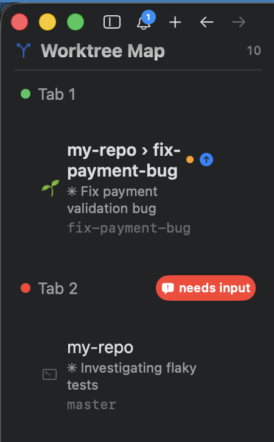

# cmux-worktree-map

[](https://github.com/oguressive/cmux-worktree-map/actions/workflows/ci.yml)

A live **worktree map sidebar** for [cmux](https://cmux.com) + [Claude Code](https://claude.com/claude-code).

Running many Claude Code sessions across git worktrees in cmux tabs? This sidebar shows, at a glance, **which worktree every session is in and what state its work is in** — and jumps to the right tab on click.



```
Tab 1
  🌱 my-repo › fix-payment-bug  🟠 ⇡   ← repository › worktree, uncommitted, unpushed
     ✳ Fix payment validation bug      ← session name
     fix-payment-bug                   ← checked-out branch

Tab 2  🔴 needs input                  ← Claude is blocked waiting for your action
     my-repo                           ← session on the main checkout (no 🌱)
     ✳ Investigating flaky tests
     master
```

Marks always reflect the session's *current* directory: inside a worktree (🌱) they show **that worktree's** uncommitted/unpushed state; on the main checkout they show the main checkout's.

## Features

- **One row per Claude Code session** — worktree (or directory) name, session title, and checked-out branch
- **🌱 worktree indicator** — instantly see which sessions run in an isolated worktree vs. the main checkout
- **🟠 uncommitted changes / ⇡ unpushed commits** — measured with real `git` against each session's *actual* working directory
- **`needs input` badge** — lights up only when Claude is *blocked* on you (permission prompt / question mid-turn), not when a session is merely idle
- **Click to jump** — selects the tab and focuses the exact pane
- **Event-driven, no daemons** — state updates whenever any session does something; no polling processes

## Why hooks? (How it works)

Claude Code switches into worktrees *inside* the `claude` process (`EnterWorktree`), so the shell — and therefore cmux — never learns the real working directory. This project closes that gap with three small Claude Code hooks:

| Component | Mechanism |
|---|---|
| `cmux-osc7-cwd.sh` | Reports the session's real cwd to its tty via an **OSC 7** escape, so cmux's per-tab directory/branch tracking becomes accurate |
| `cmux-unpushed-sync.sh` | On any session event, sweeps **all** tabs: runs `git status` / `git rev-list --count HEAD --not --remotes` per directory and publishes the result through the workspace *description* field |
| `cmux-needs-input.sh` | Tracks each session's phase (running/idle) and publishes "blocked on user" through the workspace *color* field — idle "waiting for your input" notifications are ignored |
| `sidebars/worktrees.swift` | A cmux [custom sidebar](https://cmux.com/docs/custom-sidebars) that renders it all, live |

The workspace **description** and **color** fields are used as signal channels (cmux does not yet expose custom metadata to custom sidebars). Manually-set descriptions/colors are detected and left untouched.

## Requirements

- macOS
- [cmux](https://cmux.com) with the custom-sidebars beta enabled (on by default)
- [Claude Code](https://claude.com/claude-code)
- `python3` (ships with macOS)

## Install

```sh
git clone https://github.com/oguressive/cmux-worktree-map.git
cd cmux-worktree-map
./install.sh
```

Then:

1. In cmux, **right-click the sidebar toggle button** (top-left) and pick **worktrees**
2. Restart your Claude Code sessions (or open `/hooks` once) so the hooks load

The installer merges hook registrations into `~/.claude/settings.json` non-destructively (a timestamped backup is written first) and is idempotent. It works from any terminal — it only copies files and never talks to cmux.

If the sidebar renders oddly, run `cmux sidebar validate worktrees` from a terminal **inside cmux** to see diagnostics (the control socket only accepts connections from processes running inside cmux).

## Legend

| Mark | Meaning |
|---|---|
| 🌱 | Session is inside a git worktree (`.claude/worktrees/…`) |
| 🟠 | Uncommitted changes in that session's directory |
| ⇡ | Commits not pushed to any remote |
| 🔴 `needs input` | Claude is blocked waiting for your action (permission / question) |
| 🔔 n | Unread cmux notifications for the tab |

## Freshness model

Marks update when any session fires an event (prompt submitted, file edited, `git` command run, turn ended, session started). Edits made outside Claude Code (e.g. in your editor) are picked up on the next event from any session. There is no background polling.

## Security

This project is designed to be easy to audit:

- **Zero dependencies** — plain Bash + Python 3 standard library only. No packages are downloaded or installed.
- **No network access** — the hooks and sidebar never make network requests. All state (worktree paths, git status) stays on your machine, published only into cmux's local workspace fields.
- **Small, readable surface** — 5 shell scripts and 1 sidebar file; everything that touches your system is in plain text.
- **Explicit writes only** — files written: `~/.config/cmux/sidebars/worktrees.swift`, `~/.claude/hooks/cmux-*.sh`, `~/.claude/settings.json` (merged non-destructively, timestamped backup created first), and two small state files under `~/.claude/`.
- **Continuously verified** — every push runs [ShellCheck](https://www.shellcheck.net/) (static analysis, zero findings) and [Gitleaks](https://github.com/gitleaks/gitleaks) (secret scan, full history) in [CI](https://github.com/oguressive/cmux-worktree-map/actions/workflows/ci.yml).

## Uninstall

```sh
./uninstall.sh
```

## License

[MIT](LICENSE)
